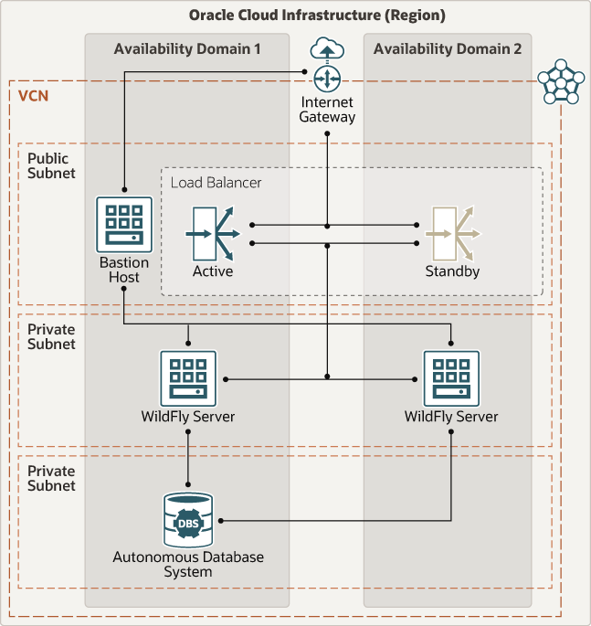

# Terraform to deploy JBoss / WildFly 20.x on Oracle Cloud Infrastructure

## Introduction

This template deploys WildFly on 1 or more VM instances in a private subnet, with an HTTP load balancer in a public subnet, as well as a bastion host to access the Admin Console. It also deploys an Autonomous Database (ATP) and configures the JBDC driver.

To deploy applications, you'll need to create the datasource(s) / JDBC connections. This can be done through the terraform or Ressource Manager input: choose the Create Datasource option and provide the necessary information.

## Requirements

- OCI account with proper credentials to create the resources
- Terraform 0.12.x or above (when running locally)

### Domain controller mode

 Domain Controller mode allows one node to manage deployments on all other nodes (the Domain Controller). If you uncheck the Domain Mode option (i.e you choose Standalone mode), you'll need to deploy applications on each individual server.

## Installation

There are 2 options to install this template:

- Run the stack with the OCI Resource manager
- Run terraform locally 

*Note that the Resource Manager does not currently support deploying the ATP database in a **private subnet**, so the default with Resource Manager is to deploy in a public subnet. The default for the terraform locally is to deploy in a private subnet.*

### Deploy Using Oracle Resource Manager

1. Click [](https://cloud.oracle.com/resourcemanager/stacks/create?region=home&zipUrl=https://github.com/oracle-quickstart/oci-jboss-wildfly-atp/releases/latest/download/oci-jboss-latest.zip)

    If you aren't already signed in, when prompted, enter the tenancy and user credentials.

2. Review and accept the terms and conditions.

3. Select the region where you want to deploy the stack.

4. Follow the on-screen prompts and instructions to create the stack.

5. After creating the stack, click **Terraform Actions**, and select **Plan**.

6. Wait for the job to be completed, and review the plan.

    To make any changes, return to the Stack Details page, click **Edit Stack**, and make the required changes. Then, run the **Plan** action again.

7. If no further changes are necessary, return to the Stack Details page, click **Terraform Actions**, and select **Apply**. 


### Run Terraform locally

Create a TF_VARS.sh file containing the following variables:

```bash
export TF_VAR_user_ocid=ocid1.user.oc1......
export TF_VAR_fingerprint=aa:aa:aa:aa:aa:aa:aa:aa:aa:aa:aa:aa:aa:aa:aa:aa
export TF_VAR_private_key_path=/path/to/.oci/oci_api_key.pem
export TF_VAR_tenancy_ocid=ocid1.tenancy.oc1.....
export TF_VAR_region=us-ashburn-1
```

Source the file with

```
. ./TF_VARS.sh
```

Create a `terraform.tfvars` config file containing the following variables:

```
tenancy_ocid = "ocid1.tenancy.oc1..."
compartment_id = "ocid1.compartment.oc1..."
region = "us-ashburn-1"

vcn_cidr_block = "10.1.0.0/16"
jboss_vm_shape = "VM.Standard.E2.1"
jboss_node_count = 2
ssh_authorized_keys = "ssh-rsa..."
jboss_admin_username = "admin"
jboss_admin_password = "myJB0ssP@ssw0rd!"

provision_atp      = true
atp_private_subnet = true
atp_admin_password = "atpPasSword1"
atp_display_name   = "JBossATP"
atp_db_name        = "atpdbjboss"

create_jdbc_ds = true
ds_name = "JDBCConnectionDS"
atp_username   = "USER"
atp_password   = "PassW0rd#1"

domain_mode = true
```

then run:

```bash
tf init
tf plan
tf apply
```

## Access the Admin Console

There is no application deployed, but once deployed applications will be available at

http://<LOAD_BALANCER_IP>/

To access the admin console, you have 2 options:

### Access the console through a SOCKSv5 proxy

Create a SOCKSv5 proxy through the public IP of the bastion host.

For example SOCKS v5 proxy on port 1088

```bash
ssh -C -D 1088 opc@150.136.41.148
```

Then configure your browser to use a manual SOCK5 proxy, (On Firefox, click **Preferences**, then search for **PROXY**, and click **Settings**). Select Manual Proxy, and SOCKSv5 option. Pass it 'localhost' as the host and 1088 as the port.

You can then connect through the browser using the Private IP of the server.

For example: http://10.1.2.2:9990/ to reach the WildFly console.

### Access the console through SSH tunnel

You can tunnel to the jboss instance through the bastion host with 

```bash
export BASTION_IP=<bastion-ip>
export HOST=<jboss-host-private-ip>

# tunnel
ssh -M -S socket -fnNT -L 9990:${HOST}:9990 opc@${BASTION_IP} cat -
ssh -S socket -O check opc@${BASTION_IP}
```

Then the admin console will be available on localhost at: http://localhost:9990/
 
### SSH to a Jboss instance

You can SSH to the JBoss instance using:

```bash
ssh -J opc@${BASTION_IP} opc@${HOST}
```

or if you need to pass a private key identity, use:

```bash
ssh -o ProxyCommand="ssh -W %h:%p -i <private_key> opc@${BASTION_IP}" -i <private_key> opc@${HOST}
```

### SCP files to a JBoss instance

To SCP files to the JBoss instance (i.e. to deploy applications)

```bash
scp -o ProxyCommand="ssh -W %h:%p opc@${BASTION_IP}" <file-to-transfer.ext> opc@${HOST}:~/
```

## Tear down

### Locally

```bash
tf destroy
```

### In the Resource Manager

1. Go to **Resource Manager -> Stacks**

2. Select the stack

3. Click **Terraform Actions** then **Destroy**

4. Once the destroy job finished, delete the stack.

## Architecture Diagram


## Reference Archirecture

For details of the architecture, see [_Deploy WildFly connected to an autonomous database_](https://docs.oracle.com/en/solutions/wildfly-oci/index.html)